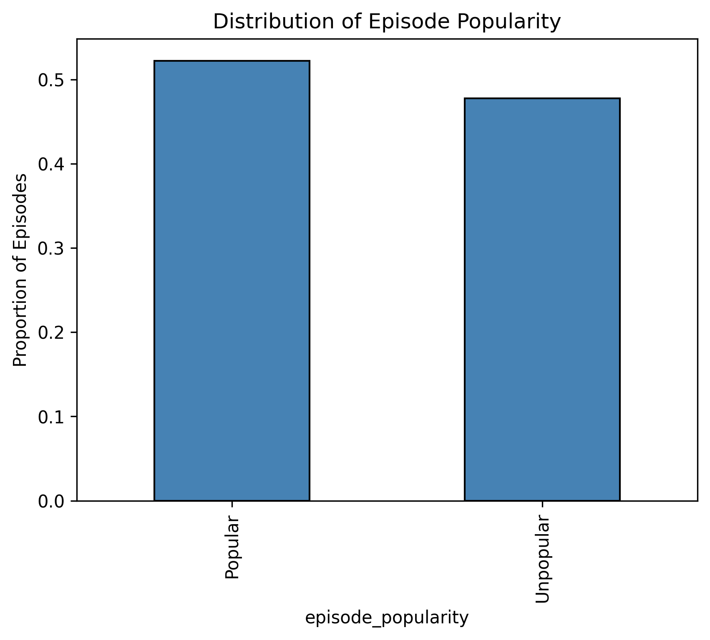
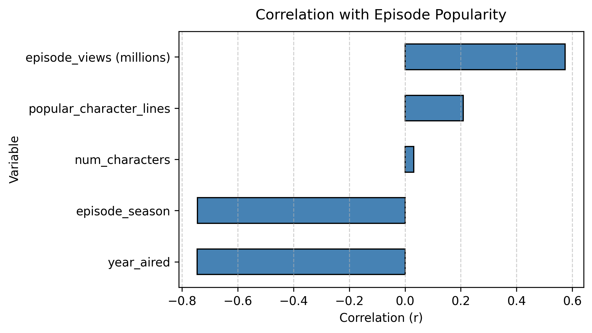
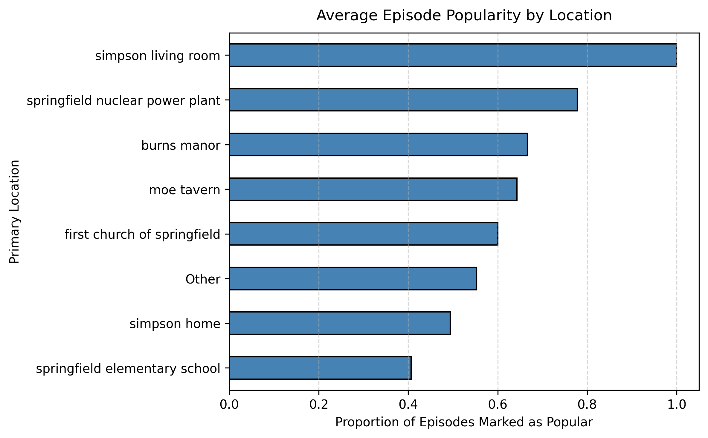
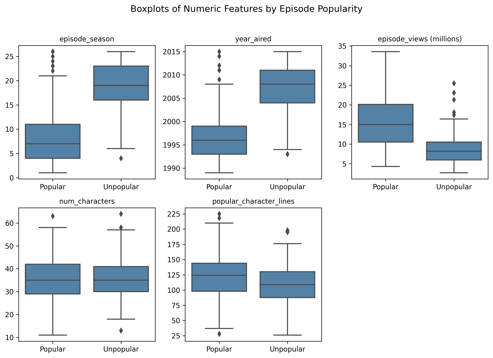

# Predicting The Simpsons Episode Popularity

A machine learning project that predicts whether a Simpsons episode will be popular based on episode metadata, viewership data, character dynamics, and location features.

**Authors:** Eshan Prakash, Ethan Hanning

---

## Overview

This project uses classification algorithms to predict episode popularity using a dataset of ~600 Simpsons episodes from [The Simpsons by the Data](https://data.world/data-society/the-simpsons-by-the-data). We compare Logistic Regression, Random Forest, and Neural Network models across different feature combinations.

### Key Findings

- **Best Model:** Neural Network with Metadata + Viewership + Character Dynamics (F1: 0.857, Precision: 0.944)
- **Top Predictors:** Episode season and year aired showed the strongest negative correlations with popularity (r = -0.745, -0.746)
- **Viewership Impact:** Moderate positive correlation with popularity (r = 0.575)
- **Character Features:** Popular character lines showed weak positive correlation (r = 0.208)

---

## Dataset

The analysis uses four datasets containing:
- **Episodes:** IMDB ratings, air dates, viewership, season information
- **Characters:** Character names and IDs
- **Locations:** Episode settings and scene locations
- **Script Lines:** Character dialogue and speaking patterns

### Target Variable

Episodes are classified as **Popular** (1) or **Unpopular** (0) based on IMDB ratings:
- **Threshold:** Median rating of 7.3
- **Final Dataset:** 561 episodes (52.23% Popular, 47.77% Unpopular)

---

## Features

Features were engineered from the raw datasets:

| Feature | Description |
|---------|-------------|
| **Episode Season** | Season number |
| **Year Aired** | Release year |
| **Episode Views** | Broadcast viewership (millions) |
| **Number of Characters** | Total speaking characters |
| **Popular Character Lines** | Lines by main characters (Homer, Marge, Bart, Lisa) |
| **Primary Location** | Main episode setting |

---

## Methodology

### Data Preprocessing
1. Created binary popularity labels using median IMDB rating (7.3)
2. Engineered features from script lines, character data, and locations
3. Removed 39 episodes with missing values
4. Standardized features for Logistic Regression and Neural Networks

### Model Training
- **Models:** Logistic Regression, Random Forest, Neural Network (MLP)
- **Hyperparameter Tuning:** GridSearchCV with 3-fold cross-validation
- **Evaluation Metric:** F1-score
- **Train-Test Split:** 80/20

### Feature Groups (Incremental Testing)
1. Metadata (season, year)
2. Metadata + Viewership
3. Metadata + Viewership + Character Dynamics
4. Metadata + Viewership + Character Dynamics + Episode Location

---

## Results

### Model Performance Comparison

| Model | Feature Group | Precision | Recall | F1 |
|-------|--------------|-----------|--------|-----|
| Logistic Regression | Metadata | 0.864 | 0.785 | 0.823 |
| Logistic Regression | Metadata + Viewership | 0.864 | 0.785 | 0.823 |
| Logistic Regression | Metadata + Viewership + Character Dynamics | 0.873 | **0.846** | 0.859 |
| Logistic Regression | Metadata + Viewership + Character Dynamics + Episode Location | 0.873 | **0.846** | 0.859 |
| Random Forest | Metadata | 0.926 | 0.769 | 0.840 |
| Random Forest | Metadata + Viewership | 0.925 | 0.754 | 0.831 |
| Random Forest | Metadata + Viewership + Character Dynamics | 0.923 | 0.738 | 0.821 |
| Random Forest | Metadata + Viewership + Character Dynamics + Episode Location | 0.923 | 0.738 | 0.821 |
| Neural Net | Metadata | 0.926 | 0.769 | 0.840 |
| Neural Net | Metadata + Viewership | 0.925 | 0.754 | 0.831 |
| **Neural Net** | **Metadata + Viewership + Character Dynamics** | **0.944** | 0.785 | **0.857** |
| Neural Net | Metadata + Viewership + Character Dynamics + Episode Location | 0.944 | 0.785 | 0.857 |

> **Note on Reproducibility:** Results may vary slightly between runs due to random state initialization in cross-validation and model training. While we use `random_state=42` where possible, GridSearchCV with parallel processing (`n_jobs>1`) can introduce non-determinism.

---

## Exploratory Data Analysis

### Popularity Distribution


### Feature Correlations



Correlation values with episode popularity:
- **Episode Season:** r = -0.745
- **Year Aired:** r = -0.746
- **Episode Views:** r = 0.575
- **Popular Character Lines:** r = 0.208
- **Number of Characters:** r = 0.032

### Popularity by Location


### Feature Distributions by Popularity


---

## Installation & Usage

### Requirements
```bash
pip install -r requirements.txt
```

### Running the Analysis

1. **Clone the repository:**
```bash
git clone https://github.com/yourusername/simpsons-popularity-prediction.git
cd simpsons-popularity-prediction
```

2. **Download the data:**
- Go to [The Simpsons by the Data](https://data.world/data-society/the-simpsons-by-the-data)
- Download these CSV files:
  - `simpsons_script_lines.csv`
  - `simpsons_locations.csv`
  - `simpsons_characters.csv`
  - `simpsons_episodes.csv`
- Place them in a directory of your choice

3. **Configure data paths:**
Update `DATA_PATH` in the first cell of the notebook:
```python
DATA_PATH = "/your/data/path"
```

4. **Run the analysis:**
```bash
jupyter notebook COMP395Assignment2Analysis.ipynb
```

---

## Project Structure

```
.
├── COMP395Assignment2Analysis.ipynb  # Main analysis notebook
├── images/                        # Generated visualizations
│   ├── popularity_distribution.png
│   ├── correlation_chart.png
│   ├── location_popularity.png
│   └── feature_boxplots.png
├── requirements.txt               # Python dependencies
├── LICENSE                        # MIT License
└── README.md

Note: CSV data files not included - download from data.world
```

---

## Technologies Used

- **Python 3.11**
- **pandas** - Data manipulation
- **NumPy** - Numerical computing
- **scikit-learn** - Machine learning models and evaluation
- **matplotlib & seaborn** - Data visualization
- **Jupyter** - Interactive analysis

---

## License

This project is licensed under the MIT License - see the [LICENSE](LICENSE) file for details.

---

## Acknowledgments

- Dataset: [The Simpsons by the Data](https://data.world/data-society/the-simpsons-by-the-data) from data.world